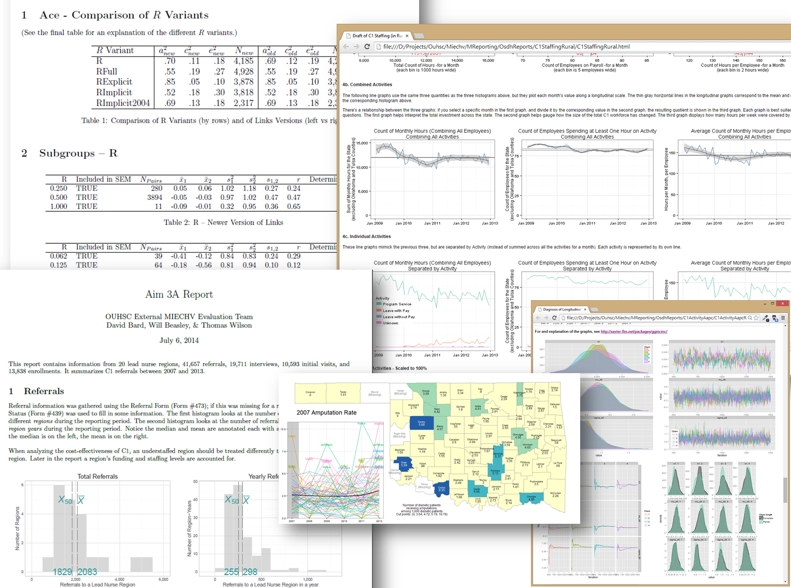

***

Welcome to Oklahoma's MIECHV Evaluation. This public-facing site provides aggregate reports and de-identified datasets to communicate the results of Oklahoma's MIECHV evaluation and distribute the 

This site is structured into primary categories, each with nested subcategories.  Please navigate this site with the dropdown boxes at the top of the page.

 * `Research Products` are a gateway to the reports used in our CQI and evaluation
 * `Other Products` contains software and datasets that mgiht be helpful to researchers pursuing similar questions.
 * `Funding` pages describe current and previous funding proposals.
 * `About` covers the collaborators and stakeholders involved in Oklahoma's overall MIECHV services and evaluations.

***

***
